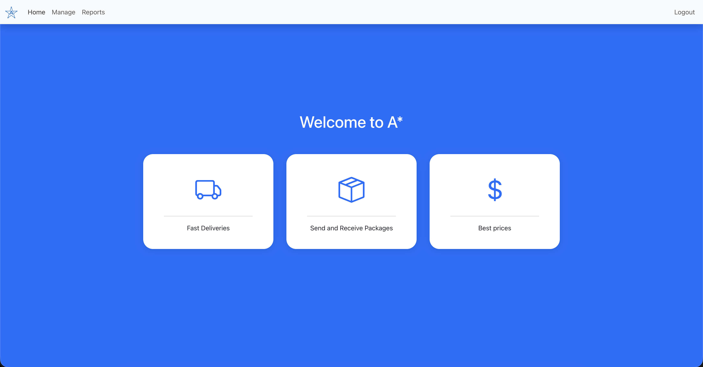
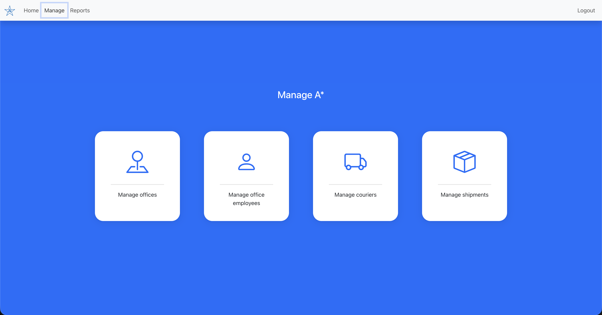
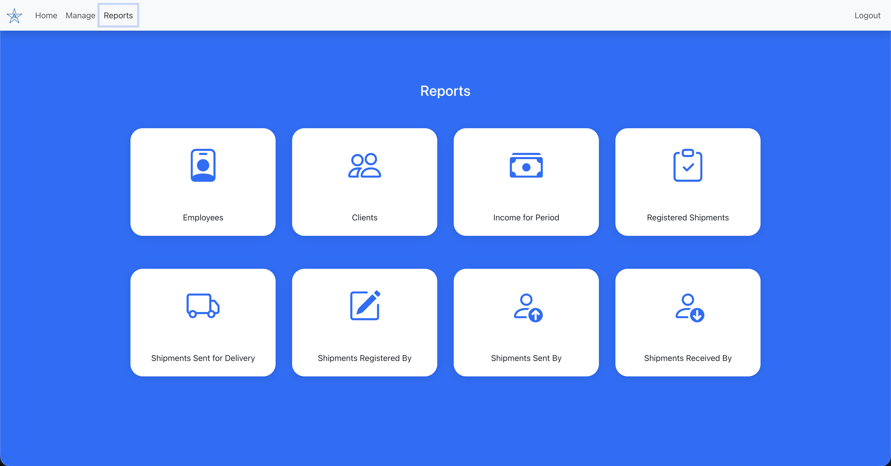
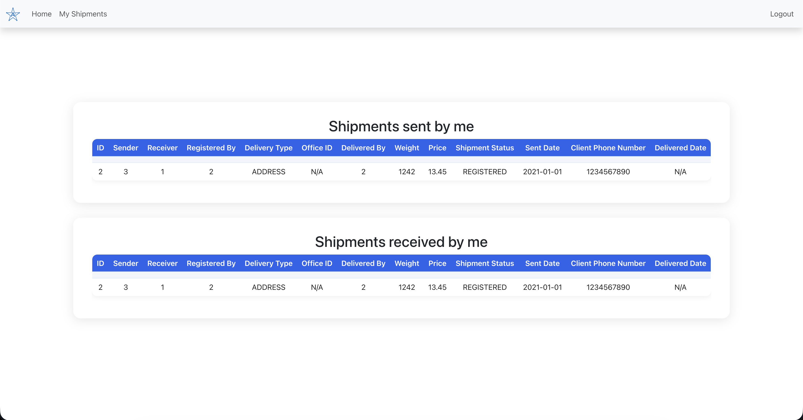
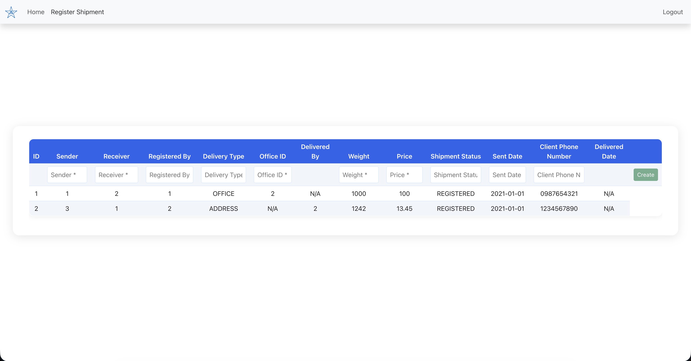
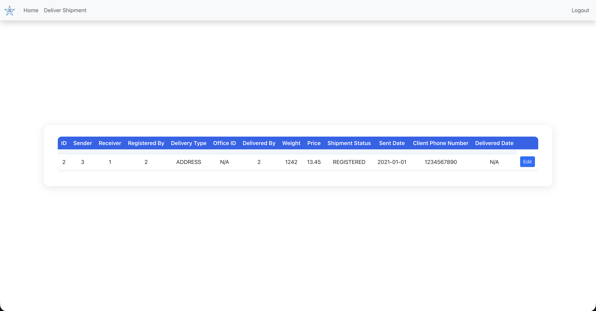

# A* Frontend

## Overview
User interface for clients, office employees, courier employees, and administrators to manage shipments, offices, employees, and reports.

## Tech Stack
- **React**, **React Query**
- **Typescript**
- **Bootstrap**
- **Axios**

## Usage & Main Flows
- **Authentication:** Users can sign up and log in. Auth state is managed by `AuthContext` and persisted in the localStorage of the browser.
- **Role-based Access:**
  - **Admin:** Manage offices, employees, couriers, shipments, and view reports.
  - **Office Employee:** Register new shipments.
  - **Courier Employee:** Update shipment delivery status.
  - **Client:** View their shipments.
- **Navigation:** The `Navbar` component conditionally renders accessible pages based on the logged-in user's role.
- **Protected Routes:** Pages are protected by `ProtectedRoute`, which checks user roles and redirects unauthorized users.

## Common Components
- **Navbar:** Top navigation bar, shows accessible pages based on user role and login state.
- **ProtectedRoute:** Wraps routes to enforce role-based access.
- **Table:** Generic and configurable CRUD table.
- **FormModal:** Generic and configurable modal dialog used for passing arguments to reports.
- **Toast:** Generic and configurable notification component for success/error messages.

## Context & Utilities
- **AuthContext:** Provides authentication state, login/logout methods, and user information.
- **axiosConfig.ts:** Configures Axios with an interceptor to add the authentication token to every request.
- **validateAuthFields.ts:** Utility for validating login/signup forms.

## Pages
- **Home:** Landing page.
- **Auth:** Login, signup, and access denied pages.
- **Manage:** Admin dashboard for managing offices, employees, couriers, and shipments.
  - **ManageOffices:** CRUD actions for offices.
  - **ManageOfficeEmployees:** CRUD actions for office employees.
  - **ManageCouriers:** CRUD actions for couriers.
  - **ManageShipments:** CRUD actions for shipments.
- **Reports:** Admin reports.
  - **ReportsHome:** Reports landing page.
  - **Report:** Generic and configurable components for viewing reports.
  - **FormConfig:** Configuration for report parameters.
- **Office Employee:** Register and manage shipments.
- **Courier Employee:** Update shipment delivery status.
- **Client:** View and track their shipments.

## Screenshots

Below are screenshots of the application showcasing the main features and user interface:

- **Home Page**
  
  

- **Admin Dashboard (Manage)**
  
  

- **Reports Page**
  
  

- **Client Shipment View**
  
  

- **Register Shipments (Office Employee)**
  
  

- **Deliver Shipments (Courier Employee)**
  
  
